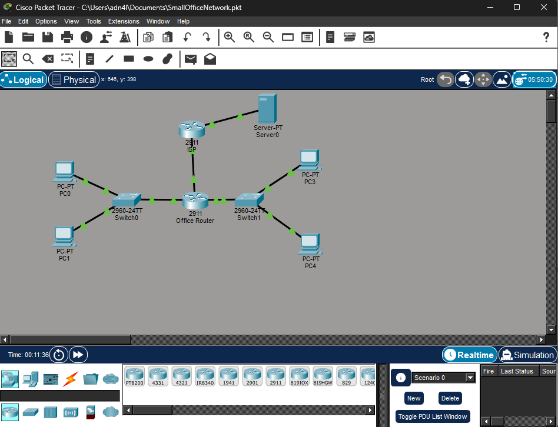

# Small Office Network Project – Cisco Packet Tracer  

## Objective  
The Small Office Network Project was created to design and configure a small enterprise network using **Cisco Packet Tracer**. The goal was to simulate a realistic office environment with multiple departments, implement VLAN segmentation, enable DHCP and DNS automation, and provide secure Internet access through NAT and ACLs. This project demonstrates an understanding of **network infrastructure, routing and switching, and enterprise-level service management**.  

### Skills Learned  
- Designing and implementing multi-VLAN network topologies  
- Configuring and managing routing between VLANs  
- Setting up DHCP and DNS for automated IP management and name resolution  
- Implementing NAT for Internet connectivity  
- Applying ACLs to enhance network security and control traffic flow  
- Configuring and managing email and web services within a simulated environment  
- Troubleshooting connectivity, routing, and service delivery in Cisco Packet Tracer  

### Tools Used  
- Cisco Packet Tracer  
- Cisco Routers and Switches (Simulated Devices)  
- DHCP and DNS Services  
- VLANs (IT and HR Departments)  
- NAT (Network Address Translation)  
- ACLs (Access Control Lists)  
- IPv4 Addressing and Static Routing  

## Steps  
1. Designed a two-department office topology using VLAN segmentation for IT and HR.  
2. Configured routers to handle inter-VLAN routing, DHCP services, and NAT for Internet access.  
3. Set up DHCP pools to automatically assign IP addresses to both departments.  
4. Added a second router to simulate an Internet service provider hosting web, DNS, and email servers.  
5. Created and configured internal (company.com) and external (isp.com) DNS and mail servers.  
6. Applied ACLs to control access between departments while maintaining secure communication.  
7. Tested network connectivity, routing, and NAT functionality using various tools and simulations.  
8. Verified DNS name resolution and email communication between internal and external domains.  
9. Documented all configurations and testing results for scalability and troubleshooting.  

## Screenshot 

### Network Topology 
  
